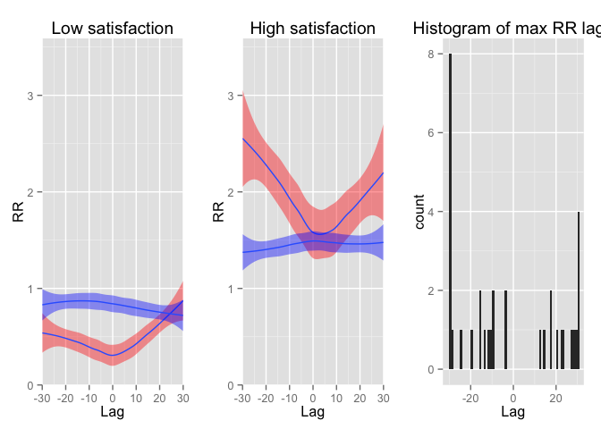
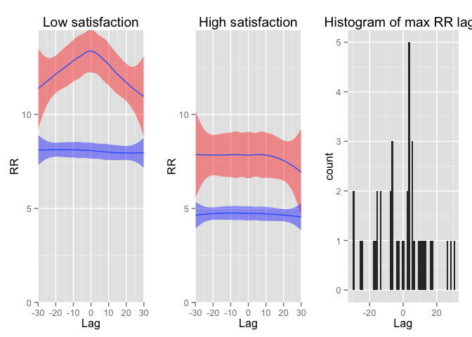
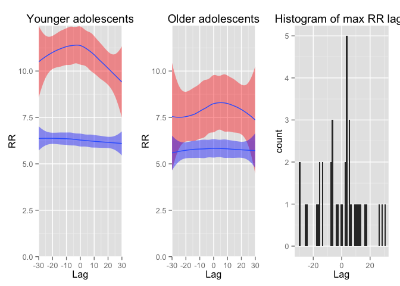
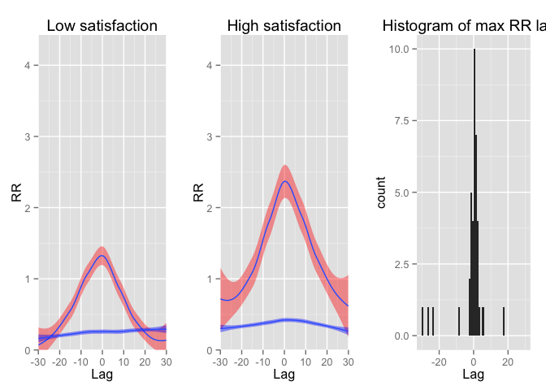
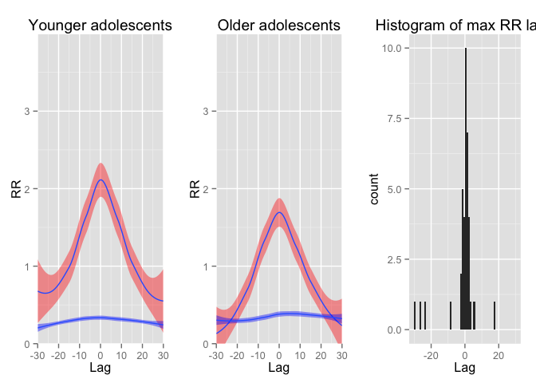

# Data Analysis for Main, Paxton, & Dale (accepted, Emotion)

Interest/Validation
-----


```r
setwd('/Main_Paxton_Dale-Analyses')

# preliminaries 
rm(list=ls())
getwd()
```

```
## [1] "/Main_Paxton_Dale-Analyses"
```

```r
source('globals_functions.R')
```

```
## Loading required package: Matrix
## Loading required package: tseriesChaos
## Loading required package: deSolve
## 
## Attaching package: 'deSolve'
## 
## The following object is masked from 'package:graphics':
## 
##     matplot
## 
## Loading required package: fields
## Loading required package: spam
## Loading required package: grid
## Spam version 1.3-0 (2015-10-24) is loaded.
## Type 'help( Spam)' or 'demo( spam)' for a short introduction 
## and overview of this package.
## Help for individual functions is also obtained by adding the
## suffix '.spam' to the function name, e.g. 'help( chol.spam)'.
## 
## Attaching package: 'spam'
## 
## The following objects are masked from 'package:base':
## 
##     backsolve, forwardsolve
## 
## Loading required package: maps
## 
##  # ATTENTION: maps v3.0 has an updated 'world' map.        #
##  # Many country borders and names have changed since 1990. #
##  # Type '?world' or 'news(package="maps")'. See README_v3. #
## 
## 
## Loading required package: plot3D
## Loading required package: pracma
## 
## Attaching package: 'pracma'
## 
## The following object is masked from 'package:deSolve':
## 
##     rk4
## 
## The following objects are masked from 'package:Matrix':
## 
##     expm, lu, tril, triu
```

```r
# specify parents' and adolescents' affect
a_target_emotion = c(int,val)
p_target_emotion = c(int,val)

# run RQA
source('get_rqa_measures.R')
```

```
## [1] 2
## [1] 3
## [1] 4
## [1] 5
## [1] 6
## [1] 7
## [1] 8
## [1] 9
## [1] 10
## [1] 11
## [1] 12
## [1] 13
## [1] 14
## [1] 15
## [1] 16
## [1] 17
## [1] 18
## [1] 19
## [1] 20
## [1] 21
## [1] 22
## [1] 23
## [1] 24
## [1] 25
## [1] 26
## [1] 27
## [1] 28
## [1] 29
## [1] 30
## [1] 31
## [1] 32
## [1] 33
## [1] 34
## [1] 35
## [1] 36
## [1] 37
## [1] 38
## [1] 39
## [1] 40
## [1] 41
## [1] 42
## [1] 43
## [1] 44
## [1] 45
## [1] 46
## [1] 47
## [1] 48
## [1] 49
## [1] 50
```

Let's look at the location of maximum lags. If one or the other is leading, we will find maximum lag location to be more on the left (parent leading) or right (adolescent leading). In general we do not find this imbalance: A one-sample t-test with maximum observed lag as the dependent variable is not significant less or greater than 0. In fact, it is centered around 0 (see plots); interestingly, in the interest/validation case, the maximum lags do show a bimodality, suggesting the turn taking pattern holds even in the maximum lag value.


```r
# only include those for which a maximum RR is observed
descriptives = descriptives[descriptives$maxrec>0,]

# print it out
pander(t.test(descriptives[descriptives$shuff=='observed',]$maxlag),style="rmarkdown")
```


|  Test statistic  |  df  |  P value  |  Alternative hypothesis  |
|:----------------:|:----:|:---------:|:------------------------:|
|     -0.5962      |  33  |  0.5551   |        two.sided         |

Table: One Sample t-test: `descriptives[descriptives$shuff == "observed", ]$maxlag`

```r
# plot interaction with satisfaction -- use PDF if we want to save as a file in a subdirectory
# pdf(file='/Main_Paxton_Dale-Analyses/plots/interestvalidation_satisfaction.pdf',width=8,height=5.25)
source('plot_drps_satisfaction.R')
```

 

```r
# dev.off()

# print model results using standardized and unstandardized coefficients
source('lmer_stats.R')
pander(coefs.simple,style="rmarkdown") # simple (just lag terms): standardized
```


|      &nbsp;       |  Estimate  |  Std..Error  |  t.value   |    p    |
|:-----------------:|:----------:|:------------:|:----------:|:-------:|
|  **(Intercept)**  | -2.094e-12 |    0.1349    | -1.552e-11 |    1    |
|   **LinearLag**   |  -0.02228  |   0.02984    |  -0.7466   | 0.4553  |
|    **QuadLag**    |  0.07685   |   0.03048    |   2.521    | 0.01169 |

```r
pander(coefs.simple.raw,style="rmarkdown") # simple (just lag terms): unstandardized
```


|      &nbsp;       |  Estimate  |  Std..Error  |  t.value  |     p     |
|:-----------------:|:----------:|:------------:|:---------:|:---------:|
|  **(Intercept)**  |  0.01368   |   0.003341   |   4.095   | 4.214e-05 |
|   **LinearLag**   | -0.004309  |   0.005772   |  -0.7466  |  0.4553   |
|    **QuadLag**    |  0.01486   |   0.005895   |   2.521   |  0.01169  |

```r
pander(coefs.satisfaction,style="rmarkdown") # lag terms and satisfaction: standardized
```


|       &nbsp;        |  Estimate  |  Std..Error  |  t.value   |    p     |
|:-------------------:|:----------:|:------------:|:----------:|:--------:|
|   **(Intercept)**   | -1.065e-12 |    0.1246    | -8.547e-12 |    1     |
|  **SatisfactionF**  |   0.3819   |    0.1226    |   3.116    | 0.001833 |
|    **LinearLag**    |  0.04341   |    0.1313    |   0.3305   |  0.741   |
|     **QuadLag**     |  -0.08813  |   0.06891    |   -1.279   |  0.2009  |
|  **SatisXLinear**   |  -0.06733  |    0.131     |  -0.5138   |  0.6074  |
|   **SatisXQuad**    |   0.1696   |   0.08094    |   2.095    | 0.03615  |

```r
pander(coefs.satisfaction.raw,style="rmarkdown") # lag terms and satisfaction: unstandardized
```


|            &nbsp;             |  Estimate  |  Std..Error  |  t.value  |
|:-----------------------------:|:----------:|:------------:|:---------:|
|        **(Intercept)**        |  -0.02837  |   0.01385    |  -2.049   |
|       **SatisfactionF**       |  0.01062   |   0.003407   |   3.116   |
|         **LinearLag**         |  0.008396  |    0.0254    |  0.3305   |
|          **QuadLag**          |  -0.01704  |   0.01333    |  -1.279   |
|  **SatisfactionF:LinearLag**  | -0.003207  |   0.006242   |  -0.5138  |
|   **SatisfactionF:QuadLag**   |  0.008078  |   0.003855   |   2.095   |

Table: Table continues below

 

|            &nbsp;             |    p     |
|:-----------------------------:|:--------:|
|        **(Intercept)**        | 0.04044  |
|       **SatisfactionF**       | 0.001833 |
|         **LinearLag**         |  0.741   |
|          **QuadLag**          |  0.2009  |
|  **SatisfactionF:LinearLag**  |  0.6074  |
|   **SatisfactionF:QuadLag**   | 0.03615  |

```r
pander(coefs.age,style="rmarkdown") # lag terms and age: standardized
```


|      &nbsp;       |  Estimate  |  Std..Error  |  t.value   |    p     |
|:-----------------:|:----------:|:------------:|:----------:|:--------:|
|  **(Intercept)**  | -1.297e-12 |    0.124     | -1.046e-11 |    1     |
|     **AgeF**      |   0.389    |    0.124     |   3.138    | 0.001701 |
|   **LinearLag**   |   0.2818   |    0.2089    |   1.349    |  0.1773  |
|    **QuadLag**    |  -0.1678   |    0.2161    |  -0.7765   |  0.4374  |
|  **AgeXLinear**   |  -0.3069   |    0.2161    |   -1.42    |  0.1556  |
|   **AgeXQuad**    |   0.2469   |    0.2236    |   1.104    |  0.2695  |

```r
pander(coefs.age.raw,style="rmarkdown") # lag terms and age: unstandardized
```


|        &nbsp;        |  Estimate  |  Std..Error  |  t.value  |    p     |
|:--------------------:|:----------:|:------------:|:---------:|:--------:|
|   **(Intercept)**    |  -0.05825  |   0.02313    |  -2.519   | 0.01178  |
|       **AgeF**       |  0.004842  |   0.001543   |   3.138   | 0.001701 |
|    **LinearLag**     |  0.05451   |   0.04041    |   1.349   |  0.1773  |
|     **QuadLag**      |  -0.03246  |   0.04181    |  -0.7765  |  0.4374  |
|  **AgeF:LinearLag**  | -0.003959  |   0.002789   |   -1.42   |  0.1556  |
|   **AgeF:QuadLag**   |  0.003186  |   0.002885   |   1.104   |  0.2695  |

Negative Emotion
------


```r
# preliminaries
rm(list=ls())
source('globals_functions.R')

# set the target emotion for these analyses and then run RQA
a_target_emotion = neg
p_target_emotion = neg
source('get_rqa_measures.R')
```

```
## [1] 2
## [1] 3
## [1] 4
## [1] 5
## [1] 6
## [1] 7
## [1] 8
## [1] 9
## [1] 10
## [1] 11
## [1] 12
## [1] 13
## [1] 14
## [1] 15
## [1] 16
## [1] 17
## [1] 18
## [1] 19
## [1] 20
## [1] 21
## [1] 22
## [1] 23
## [1] 24
## [1] 25
## [1] 26
## [1] 27
## [1] 28
## [1] 29
## [1] 30
## [1] 31
## [1] 32
## [1] 33
## [1] 34
## [1] 35
## [1] 36
## [1] 37
## [1] 38
## [1] 39
## [1] 40
## [1] 41
## [1] 42
## [1] 43
## [1] 44
## [1] 45
## [1] 46
## [1] 47
## [1] 48
## [1] 49
## [1] 50
```

```r
# only include those for which a maximum RR is observed
descriptives = descriptives[descriptives$maxrec>0,]

# print it out
pander(t.test(descriptives[descriptives$shuff=='observed',]$maxlag),style="rmarkdown")
```


|  Test statistic  |  df  |  P value  |  Alternative hypothesis  |
|:----------------:|:----:|:---------:|:------------------------:|
|     -0.4161      |  39  |  0.6796   |        two.sided         |

Table: One Sample t-test: `descriptives[descriptives$shuff == "observed", ]$maxlag`

```r
# plot interaction with satisfaction -- use PDF if we want to save as a file in a subdirectory
# pdf(file='/Main_Paxton_Dale-Analyses/plots/negative_satisfaction.pdf',width=8,height=5.25)
source('plot_drps_satisfaction.R')
```

 

```r
# dev.off()

# plot interaction with age -- use PDF if we want to save as a file in a subdirectory
# pdf(file='/Main_Paxton_Dale-Analyses/plots/negative_age.pdf',width=8,height=5.25)
source('plot_drps_age.R')
```

 

```r
# dev.off()

# print model results using standardized and unstandardized ("raw") coefficients
source('lmer_stats.R')
pander(coefs.simple,style="rmarkdown") # simple (just lag terms): standardized
```


|      &nbsp;       |  Estimate  |  Std..Error  |  t.value  |    p     |
|:-----------------:|:----------:|:------------:|:---------:|:--------:|
|  **(Intercept)**  | -5.873e-12 |    0.1432    | -4.1e-11  |    1     |
|   **LinearLag**   |  -0.01346  |   0.01003    |  -1.342   |  0.1797  |
|    **QuadLag**    |  -0.02796  |   0.008803   |  -3.176   | 0.001494 |

```r
pander(coefs.simple.raw,style="rmarkdown") # simple (just lag terms): unstandardized
```


|      &nbsp;       |  Estimate  |  Std..Error  |  t.value  |    p     |
|:-----------------:|:----------:|:------------:|:---------:|:--------:|
|  **(Intercept)**  |   0.0958   |   0.01809    |   5.297   | 1.18e-07 |
|   **LinearLag**   |  -0.01328  |   0.009894   |  -1.342   |  0.1797  |
|    **QuadLag**    |  -0.02757  |   0.00868    |  -3.176   | 0.001494 |

```r
pander(coefs.satisfaction,style="rmarkdown") # lag terms and satisfaction: standardized
```


|       &nbsp;        |  Estimate  |  Std..Error  |  t.value   |    p     |
|:-------------------:|:----------:|:------------:|:----------:|:--------:|
|   **(Intercept)**   | -9.869e-12 |    0.1324    | -7.457e-11 |    1     |
|  **SatisfactionF**  |  -0.4053   |    0.1324    |   -3.063   | 0.002195 |
|    **LinearLag**    |  0.00563   |   0.04612    |   0.1221   |  0.9028  |
|     **QuadLag**     |  -0.04619  |   0.02463    |   -1.875   | 0.06074  |
|  **SatisXLinear**   |  -0.01957  |   0.04612    |  -0.4243   |  0.6713  |
|   **SatisXQuad**    |  0.01752   |    0.0287    |   0.6104   |  0.5416  |

```r
pander(coefs.satisfaction.raw,style="rmarkdown") # lag terms and satisfaction: unstandardized
```


|            &nbsp;             |  Estimate  |  Std..Error  |  t.value  |
|:-----------------------------:|:----------:|:------------:|:---------:|
|        **(Intercept)**        |   0.3234   |   0.07617    |   4.246   |
|       **SatisfactionF**       |  -0.05745  |   0.01876    |  -3.063   |
|         **LinearLag**         |  0.005551  |   0.04548    |  0.1221   |
|          **QuadLag**          |  -0.04554  |   0.02428    |  -1.875   |
|  **SatisfactionF:LinearLag**  | -0.004752  |    0.0112    |  -0.4243  |
|   **SatisfactionF:QuadLag**   |  0.004254  |   0.006969   |  0.6104   |

Table: Table continues below

 

|            &nbsp;             |     p     |
|:-----------------------------:|:---------:|
|        **(Intercept)**        | 2.179e-05 |
|       **SatisfactionF**       | 0.002195  |
|         **LinearLag**         |  0.9028   |
|          **QuadLag**          |  0.06074  |
|  **SatisfactionF:LinearLag**  |  0.6713   |
|   **SatisfactionF:QuadLag**   |  0.5416   |

```r
pander(coefs.age,style="rmarkdown") # lag terms and age: standardized
```


|      &nbsp;       |  Estimate  |  Std..Error  |  t.value   |    p    |
|:-----------------:|:----------:|:------------:|:----------:|:-------:|
|  **(Intercept)**  | -5.049e-12 |    0.1438    | -3.511e-11 |    1    |
|     **AgeF**      |  -0.1152   |    0.1438    |  -0.8007   | 0.4233  |
|   **LinearLag**   |  -0.1639   |   0.07314    |   -2.241   | 0.02502 |
|    **QuadLag**    |  -0.06263  |   0.06878    |  -0.9107   | 0.3625  |
|  **AgeXLinear**   |   0.1518   |   0.07314    |   2.075    | 0.03795 |
|   **AgeXQuad**    |  0.03492   |   0.07113    |   0.4909   | 0.6235  |

```r
pander(coefs.age.raw,style="rmarkdown") # lag terms and age: unstandardized
```


|        &nbsp;        |  Estimate  |  Std..Error  |  t.value  |    p    |
|:--------------------:|:----------:|:------------:|:---------:|:-------:|
|   **(Intercept)**    |   0.2043   |    0.1368    |   1.494   | 0.1351  |
|       **AgeF**       | -0.007306  |   0.009124   |  -0.8007  | 0.4233  |
|    **LinearLag**     |  -0.1616   |   0.07211    |  -2.241   | 0.02502 |
|     **QuadLag**      |  -0.06175  |   0.06781    |  -0.9106  | 0.3625  |
|  **AgeF:LinearLag**  |  0.009985  |   0.004811   |   2.075   | 0.03795 |
|   **AgeF:QuadLag**   |  0.002297  |   0.004679   |  0.4909   | 0.6235  |

Positive Emotion
------


```r
# preliminaries
rm(list=ls())
source('globals_functions.R')

# set the target emotion for these analyses and then run RQA
a_target_emotion = pos
p_target_emotion = pos
source('get_rqa_measures.R')
```

```
## [1] 2
## [1] 3
## [1] 4
## [1] 5
## [1] 6
## [1] 7
## [1] 8
## [1] 9
## [1] 10
## [1] 11
## [1] 12
## [1] 13
## [1] 14
## [1] 15
## [1] 16
## [1] 17
## [1] 18
## [1] 19
## [1] 20
## [1] 21
## [1] 22
## [1] 23
## [1] 24
## [1] 25
## [1] 26
## [1] 27
## [1] 28
## [1] 29
## [1] 30
## [1] 31
## [1] 32
## [1] 33
## [1] 34
## [1] 35
## [1] 36
## [1] 37
## [1] 38
## [1] 39
## [1] 40
## [1] 41
## [1] 42
## [1] 43
## [1] 44
## [1] 45
## [1] 46
## [1] 47
## [1] 48
## [1] 49
## [1] 50
```

```r
# only include those for which a maximum RR is observed
descriptives = descriptives[descriptives$maxrec>0,]

# print it out
pander(t.test(descriptives[descriptives$shuff=='observed',]$maxlag),style="rmarkdown")
```


|  Test statistic  |  df  |  P value  |  Alternative hypothesis  |
|:----------------:|:----:|:---------:|:------------------------:|
|      -1.369      |  38  |  0.1791   |        two.sided         |

Table: One Sample t-test: `descriptives[descriptives$shuff == "observed", ]$maxlag`

```r
# plot interaction with satisfaction -- use PDF if we want to save as a file in a subdirectory
# pdf(file='/Main_Paxton_Dale-Analyses/plots/positive_satisfaction.pdf',width=8,height=5.25)
source('plot_drps_satisfaction.R')
```

 

```r
# dev.off()

# plot interaction with age -- use PDF if we want to save as a file in a subdirectory
# pdf(file='/Main_Paxton_Dale-Analyses/plots/positive_age.pdf',width=8,height=5.25)
source('plot_drps_age.R')
```

 

```r
# dev.off()

# print model results using standardized and unstandardized ("raw") coefficients
source('lmer_stats.R')
pander(coefs.simple,style="rmarkdown") # simple (just lag terms): standardized
```


|      &nbsp;       |  Estimate  |  Std..Error  |  t.value  |     p     |
|:-----------------:|:----------:|:------------:|:---------:|:---------:|
|  **(Intercept)**  | 2.632e-13  |    0.1225    | 2.148e-12 |     1     |
|   **LinearLag**   |  0.007195  |   0.01379    |  0.5217   |  0.6018   |
|    **QuadLag**    |   -0.196   |   0.04619    |  -4.243   | 2.201e-05 |

```r
pander(coefs.simple.raw,style="rmarkdown") # simple (just lag terms): unstandardized
```


|      &nbsp;       |  Estimate  |  Std..Error  |  t.value  |     p     |
|:-----------------:|:----------:|:------------:|:---------:|:---------:|
|  **(Intercept)**  |  0.009871  |   0.00273    |   3.616   | 0.0002991 |
|   **LinearLag**   |  0.001251  |   0.002399   |  0.5217   |  0.6018   |
|    **QuadLag**    |  -0.03409  |   0.008035   |  -4.243   | 2.201e-05 |

```r
pander(coefs.satisfaction,style="rmarkdown") # lag terms and satisfaction: standardized
```


|       &nbsp;        |  Estimate  |  Std..Error  |  t.value  |    p    |
|:-------------------:|:----------:|:------------:|:---------:|:-------:|
|   **(Intercept)**   | 2.803e-13  |    0.1213    | 2.31e-12  |    1    |
|  **SatisfactionF**  |   0.1739   |    0.1093    |   1.591   | 0.1117  |
|    **LinearLag**    |  -0.09852  |   0.06148    |  -1.602   | 0.1091  |
|     **QuadLag**     |  -0.07803  |    0.1235    |  -0.6318  | 0.5275  |
|  **SatisXLinear**   |   0.1084   |   0.06148    |   1.762   | 0.07801 |
|   **SatisXQuad**    |  -0.1225   |    0.1454    |  -0.8422  | 0.3997  |

```r
pander(coefs.satisfaction.raw,style="rmarkdown") # lag terms and satisfaction: unstandardized
```


|            &nbsp;             |  Estimate  |  Std..Error  |  t.value  |
|:-----------------------------:|:----------:|:------------:|:---------:|
|        **(Intercept)**        | -0.007355  |   0.01116    |  -0.659   |
|       **SatisfactionF**       |  0.004348  |   0.002733   |   1.591   |
|         **LinearLag**         |  -0.01714  |   0.01069    |  -1.602   |
|          **QuadLag**          |  -0.01357  |   0.02148    |  -0.6318  |
|  **SatisfactionF:LinearLag**  |  0.004641  |   0.002634   |   1.762   |
|   **SatisfactionF:QuadLag**   | -0.005247  |   0.00623    |  -0.8422  |

Table: Table continues below

 

|            &nbsp;             |    p    |
|:-----------------------------:|:-------:|
|        **(Intercept)**        | 0.5099  |
|       **SatisfactionF**       | 0.1117  |
|         **LinearLag**         | 0.1091  |
|          **QuadLag**          | 0.5275  |
|  **SatisfactionF:LinearLag**  | 0.07801 |
|   **SatisfactionF:QuadLag**   | 0.3997  |

```r
pander(coefs.age,style="rmarkdown") # lag terms and age: standardized
```


|      &nbsp;       |  Estimate  |  Std..Error  |  t.value  |   p    |
|:-----------------:|:----------:|:------------:|:---------:|:------:|
|  **(Intercept)**  | 3.416e-13  |    0.123     | 2.778e-12 |   1    |
|     **AgeF**      |  -0.1107   |    0.1223    |  -0.9053  | 0.3653 |
|   **LinearLag**   |  -0.07085  |    0.1057    |   -0.67   | 0.5028 |
|    **QuadLag**    |  -0.3491   |    0.3627    |  -0.9626  | 0.3357 |
|  **AgeXLinear**   |  0.07869   |    0.1086    |  0.7246   | 0.4687 |
|   **AgeXQuad**    |   0.155    |    0.3752    |  0.4133   | 0.6794 |

```r
pander(coefs.age.raw,style="rmarkdown") # lag terms and age: unstandardized
```


|        &nbsp;        |  Estimate  |  Std..Error  |  t.value  |   p    |
|:--------------------:|:----------:|:------------:|:---------:|:------:|
|   **(Intercept)**    |  0.02828   |   0.02052    |   1.378   | 0.1681 |
|       **AgeF**       | -0.001239  |   0.001369   |  -0.9053  | 0.3653 |
|    **LinearLag**     |  -0.01232  |   0.01839    |   -0.67   | 0.5028 |
|     **QuadLag**      |  -0.06073  |   0.06309    |  -0.9626  | 0.3357 |
|  **AgeF:LinearLag**  | 0.0009131  |   0.00126    |  0.7246   | 0.4687 |
|   **AgeF:QuadLag**   |  0.001799  |   0.004353   |  0.4133   | 0.6794 |


Correlation between Dyad Satisfaction and Adolescent Age
------

Given systematic similarities between the age and satisfaction models, we checked whether age and satisfaction correlate with one another.  As presented below, we do not find a reliable correlation between age and satisfaction variables.


```r
# grab only one slice from each dyad
corr_check = drps_raw[drps_raw$RawLag==0,]
pander(cor.test(corr_check$Satisfaction,corr_check$Age))
```


|  Test statistic  |  df  |  P value  |  Alternative hypothesis  |
|:----------------:|:----:|:---------:|:------------------------:|
|      1.077       |  47  |  0.2868   |        two.sided         |

Table: Pearson's product-moment correlation: `corr_check$Satisfaction` and `corr_check$Age`
